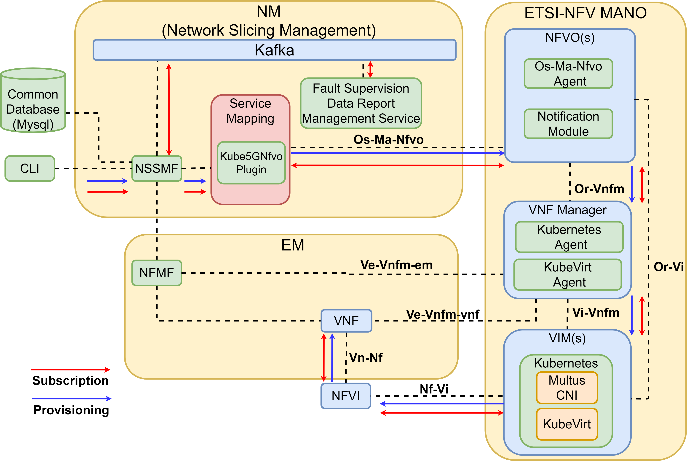

# Free5GMANO — 5G Network Slice Subnet Management & Orchestration

> An open-source NFV-MANO framework for orchestrating and managing the lifecycle of Network Slice Subnet Instances (NSSI) in a 5G Core Network, compliant with **3GPP TS 28.531/28.532 (R15)** and **ETSI NFV-MANO** standards.

---

## Table of Contents

- [Overview](#overview)
- [Architecture](#architecture)
- [Repository Structure](#repository-structure)
- [Prerequisites](#prerequisites)
- [Installation](#installation)
- [Usage](#usage)
- [Network Slice Lifecycle](#network-slice-lifecycle)
- [Standards Compliance](#standards-compliance)
- [Authors](#authors)
- [References](#references)

---

## Overview

Free5GMANO is a lightweight Management and Orchestration (MANO) framework designed to automate the deployment and lifecycle management of 5G Core Network slices. It enables:

- **Automated orchestration** of 5G Core Container Network Functions (CNFs) on Kubernetes
- **Network Slice Subnet Instance (NSSI)** creation, configuration, monitoring, and termination
- **SLA assurance** for eMBB, URLLC, and mMTC service types
- **Standards-based interfaces** (Os-Ma-nfvo, Or-Vnfm, Or-Vi, Ve-Vnfm) for interoperability

The system integrates with **free5GC** as the 5G Core implementation and uses **Kubernetes (MicroK8s)** as the underlying Virtual Infrastructure Manager (VIM).

---

## Architecture


### Key Components

| Component | Role |
|---|---|
| **Free5GMANO** | Core MANO framework (NFVO + VNFM); orchestration and lifecycle decisions |
| **SMP** | Service Management Platform; maps services to underlying network functions |
| **Kube5GNFVO** | Kubernetes-aware NFVO plugin; translates MANO requests to K8s artifacts |
| **Kubernetes (K8s)** | VIM and execution infrastructure for all 5G Core CNFs |
| **free5GMANO-CLI** | Command-line client for interacting with the MANO system |
| **free5GMANO-WebUI** | Web-based graphical interface (NGUI) |


---

## Prerequisites

- **OS**: Ubuntu 20.04 / 22.04
- **Kubernetes**: MicroK8s v1.24+ (with Multus CNI and KubeVirt)
- **Python**: 3.8+
- **Docker**: 20.10+
- **Tools**: `kubectl`
- **5G Core**: free5GC (for end-to-end testing)

---

## Installation

### 1. Clone the repository

```bash
git clone https://github.com/knguyenz/Mano.git
cd Mano
```

### 2. Set up Kubernetes (MicroK8s)

```bash
sudo snap install microk8s --classic
microk8s enable dns storage multus
sudo usermod -aG microk8s $USER
```

### 3. Deploy Free5GMANO

```bash
cd free5gmano
cd deploy
kubectl apply -f .
```
### 4. Deploy Kube5gnfvo
```bash
following: 
```

### 5. Verify all pods are running

```bash
kubectl get pods -A
```

Expected pods include: `free5gmano`, `free5gmano-mysql`, `kafka`, `zookeeper`, `kube5gnfvo`, `kubevirt` components.

### 5. Install the CLI client

```bash
cd free5gmano-cli
pip install -r requirements.txt
```

---

## Usage

### Access the Web UI

After deployment, access the NGUI interface at:
```
http://<node-ip>:<nodeport>
```

### Using the CLI (`nmctl`)

```bash
# List registered NFVO plugins
nmctl get plugin

# List uploaded templates
nmctl get template

# List all NSST (Network Slice Subnet Templates)
nmctl get nsst

# List all NSSI (Network Slice Subnet Instances)
nmctl get nssi
```

### Creating a Network Slice (Step-by-step)

**Step 1 — Onboard VNF, NSD, and NRM templates**

```bash
# Upload VNF descriptor
nmctl create template -t VNF -n kube5gnfvo
nmctl onboard template <VNF_ID>
# Upload Network Service Descriptor
nmctl create template -t NSD -n kube5gnfvo
nmctl onboard template <NSD_ID>
# Upload Network Resource Model
nmctl create template -t NRM -n kube5gnfvo
nmctl onboard template <NRM_ID>
```

**Step 2 — Create a Network Slice Subnet Template (NSST)**

```bash
nmctl create nsst -n kube5gnfvo <VNF_ID> <NSD_ID> <NRM_ID>
```

**Step 3 — Allocate a Network Slice Subnet Instance (NSSI)**

```bash
nmctl allocate nssi <NSST_ID>
```

**Step 4 — Check NSSI status**

```bash
nmctl get nssi
```

The instance should show `Administrative State: LOCKED` and `Operational State: ENABLED` when active.

**Deallocate an NSSI**

```bash
nmctl deallocate nssi  <NSSI_ID>
```


---

## Standards Compliance

| Standard | Description |
|---|---|
| 3GPP TS 28.531 (R15) | Management and orchestration of networks and network slicing |
| 3GPP TS 28.532 (R15) | Management services for communication service assurance |
| ETSI GS NFV 002 | NFV Architectural Framework |
| ETSI GS NFV-SOL 005 | RESTful protocols for Os-Ma-nfvo reference point |
| GSMA GST | Generic Network Slice Template |

---

---

## Authors

This project was developed as part of **Design Project I** at the **School of Electrical and Electronic Engineering, Hanoi University of Science and Technology (HUST)**.

| Name | Student ID |
|---|---|
| Nguyễn Trọng Phúc | 20224099 |
| Phan Khôi Nguyên | 20233925 |
| Bùi Đỗ Hoàng Minh | 20233920 |


---

## References

- [free5GC](https://github.com/free5gc/free5gc) — Open-source 5G Core Network (3GPP R15)
- [free5GMANO](https://github.com/free5gmano/free5gmano) — Original free5GMANO project
- ETSI GS NFV 002 v1.2.1 — NFV Architectural Framework
- ETSI GS NFV-SOL 005 — Os-Ma-nfvo RESTful protocols specification
- 3GPP TS 28.531 — Management and orchestration of networks and network slicing
- 3GPP TS 29.501 — 5G Network Architecture

---


